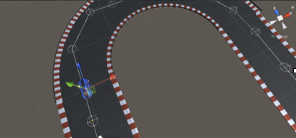
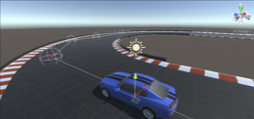
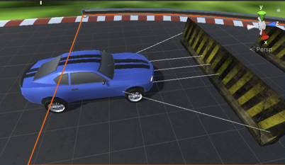
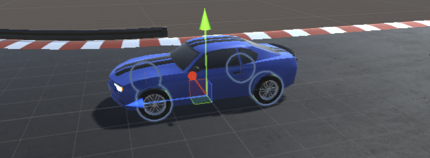

# Self-Driving Car Obstacle Avoidance Simulation

A Unity and C# simulation that explores how a self-driving car can navigate a predefined path, detect obstacles using sensors, and automatically steer around them in a controlled virtual environment.



## Overview

Self-driving systems need to respond to planned routes, road layouts, and unexpected obstacles. Testing different scenarios with a physical vehicle can require significant time, resources, equipment, and potentially risky situations.

This project explores how a **virtual simulation can provide a controlled environment for testing vehicle behavior**. The car follows a predefined path through a simulated track, uses raycast-based sensors to detect obstacles, and adjusts its steering to avoid them.

Because the environment is simulated, different paths and obstacles can be introduced and tested without relying on a physical vehicle.

## Project Overview

The simulation combines several systems to create the self-driving behavior:

- **Waypoint navigation** — the car follows a sequence of nodes that define its path.
- **Sensor-based obstacle detection** — multiple raycast sensors check the area around the front of the car.
- **Automatic obstacle avoidance** — sensor results influence the direction the car steers when an obstacle is detected.
- **Vehicle physics** — Unity `WheelCollider` components handle steering, motor torque, braking, and wheel behavior.
- **Path visualization** — Unity Gizmos are used to visualize the path and its nodes during development.

## How It Works

### 1. Path Navigation

The track contains a series of waypoint nodes. The car keeps track of its current node and uses its position relative to the next node to determine its steering direction.

When the car reaches a node, it advances to the next one and continues following the path.



### 2. Sensor-Based Obstacle Detection

The car uses multiple raycast sensors positioned around the front of the vehicle.

The sensors check:

- Center
- Front-left
- Front-right
- Angled left and right directions

When a raycast detects an object that is not part of the terrain, the sensor results are used to determine an avoidance direction.



### 3. Automatic Steering

When there is no obstacle, steering is based on the vehicle's position relative to the next waypoint.

When an obstacle is detected, the avoidance calculation takes priority and determines whether the vehicle should steer left or right.

The steering angle is smoothly applied to the front wheels rather than changing instantly.

### 4. Vehicle Physics

The vehicle uses Unity's `WheelCollider` system for its driving behavior.

The implementation controls:

- Motor torque
- Steering angle
- Brake torque
- Wheel rotation
- Vehicle center of mass
- Speed tracking

A separate `CarWheel` script synchronizes the visible wheel meshes with their corresponding `WheelCollider` components.



## Built With

- Unity 6.6.4f1
- C#
- Unity `WheelCollider`
- Unity Physics
- Unity Gizmos

## Core Scripts

### `CarEngine.cs`

The main vehicle controller. Handles:

- Path following
- Sensor detection
- Obstacle avoidance
- Steering
- Motor torque
- Braking
- Speed tracking
- Waypoint progression

### `CarWheel.cs`

Synchronizes the visible wheel meshes with their corresponding `WheelCollider` components.

### `Path.cs`

Visualizes the waypoint path in the Unity Editor using Gizmos.

## Project Structure

```text
Assets/
├── Art/
│   ├── Characters/
│   ├── Environment/
│   ├── Obstacles/
│   ├── Track/
│   └── Vehicles/
├── Scenes/
└── Scripts/
    ├── CarEngine.cs
    ├── CarWheel.cs
    └── Path.cs
```

## Why Simulation?

A major idea behind this project is that simulation can provide a controlled environment for experimenting with self-driving behavior before moving to physical testing.

Different paths, obstacles, and driving situations can be introduced without the material costs, vehicle damage, or real-world risks that can come with repeatedly testing scenarios using a physical vehicle.

This project represents that concept on a smaller scale: a vehicle navigates a virtual track, detects obstacles, and responds to them in real time.

## Future Improvements

A natural next step would be improving how the vehicle handles situations where an obstacle cannot be safely avoided.

Potential improvements include:

- Detecting when all available avoidance directions are blocked.
- Reducing speed when an obstacle is detected.
- Stopping when no safe path is available.
- Supporting additional driving scenarios and more complex environments.

## Demo

### Full Track Demo

[▶️ Watch the Full Track Demo](videos/full-track-demo.mp4)

A full-track recording showing the vehicle navigating the predefined path.

### Obstacle Avoidance Demo

[▶️ Watch the Obstacle Avoidance Demo](videos/obstacle-avoidance-demo.mp4)

A close-up recording showing the vehicle detecting and steering around obstacles.

